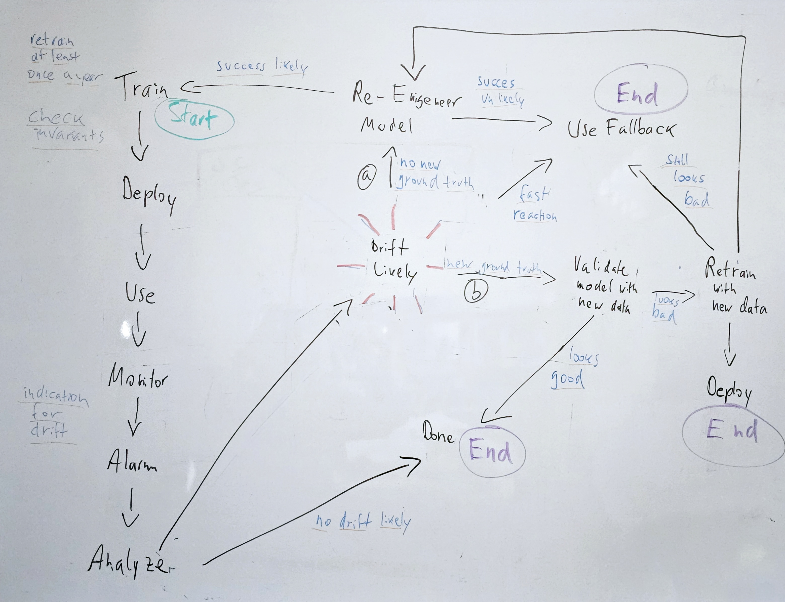

# Story

## Preparation
1. make sure you have installed the project as described in https://github.com/DJCordhose/mlops-drift/blob/main/README.md#installation
1. Introduce yourself to your neighbors and build teams of 2-4 people
   * what do you do
   * what do you know already
   * what questions do you wish answered today? what topics addressed?  
   * you can of course participate all by yourself, but it is highly recommended to form a team
1. Start project as described in Readme: 
   1. local: docker compose up
   1. remote: https://gitpod.io/#https://github.com/DJCordhose/mlops-drift

## How you can benefit
There is a lot of material to be covered, so there will be limited time to try things completely one your own.

There are different modes of participation, you will benefit from all of them. 
Choose depending on previous knowledge and your preferences:
1. No installation on your side necessary:
   1. Do this in cinema mode
   1. Ask questions at any time
1. At least some parts should be running
   1. Do what Olli does in sync
   1. Fork at any point and make your own experiments, you are welcome to give a report of what you learned

## Part I

**Working on the bigger picture**

### Use Case
1. Overview: https://djcordhose.github.io/mlops-drift/2023-odsc.html#/use-case
1. **demo** request: https://djcordhose.github.io/mlops-drift/2023-odsc.html#/demo-request
   * open app on port 8080 (or forwarded port)
   * issue one request using swagger
   * execute generate curl as well
1. Basics of our model
   * https://djcordhose.github.io/mlops-drift/2023-odsc.html#/starting-point
   * dataset represents one month of data  
   * identifying invariants of the model

### Motivation/Issue   
1. Could be end of the story, 
1. but: models degenerate: https://djcordhose.github.io/mlops-drift/2023-odsc.html#/model-degrade
1. intervention might be necessary: https://djcordhose.github.io/mlops-drift/2023-odsc.html#/model-intervention

### Approach: Monitor for data drift
1. our story starts where others end
   * when to intervene? how do we know that model performance degrades?
   * what we wish: check performance in prod vs train
   * often we can not do that, as ground truth misses or comes with significant delay
     * question: how long would we have to wait in our example?
1. our trick: use a surrogate      
   * compare distributions from training to prod: https://djcordhose.github.io/mlops-drift/2023-odsc.html#/model-drift
   * even if we have ground truth, it might not be enough and a surrogate might help: https://www.evidentlyai.com/blog/ml-monitoring-do-i-need-data-drift
   * example age: https://djcordhose.github.io/mlops-drift/2023-odsc.html#/age-distribution
   * does this drift? https://djcordhose.github.io/mlops-drift/2023-odsc.html#/age-drift-1
   * and this? https://djcordhose.github.io/mlops-drift/2023-odsc.html#/age-drift-2
   * we will revisit this later, first we need some tooling to find out
1. **demo** and **shared hands-on** Monitoring setup: 
   1. looking at the services one by one:
      * birds eye view: https://djcordhose.github.io/mlops-drift/2023-odsc.html#/monitoring-stack
     1. Visualization of drift in Grafana
     1. But: where does the drift data come from? 
     1. Prometheus as a data source
        * search for drift
     1. But: how does it get into the ts database?
     1. monitoring server     
     * birds eye view again: https://djcordhose.github.io/mlops-drift/2023-odsc.html#/monitoring-stack
   1. we simulate production use
      * three years worth of production data
      * 1500 each month
      * fast, but predictions are mocked`./scripts/curl-drift-mock.sh <URL app server>`
      * much slower, but we can monitor prediction drift as well `./scripts/curl-drift-prediction.sh <URL app server>`

## Part II

**Working on the bigger picture**

### How did we do the actual monitoring: Introducing Evidently

* kinds of drift: https://djcordhose.github.io/mlops-drift/2023-odsc.html#/types-drift
* which test to use
  * https://djcordhose.github.io/mlops-drift/2023-odsc.html#/stats-test
    * https://djcordhose.github.io/mlops-drift/2023-odsc.html#/Wasserstein
    * https://djcordhose.github.io/mlops-drift/2023-odsc.html#/Jensen-Shannon
  * https://www.evidentlyai.com/blog/data-drift-detection-large-datasets
* **notebook** developing drift metrics: https://colab.research.google.com/github/djcordhose/mlops-drift/blob/main/notebooks/drift.ipynb?hl=en
* matching **code**: `src/insurance_prediction/monitoring/data_drift.py`

### What is actually going on: Analysis

1. Looking at distributions: https://opendatascience.com/mlops-monitoring-and-managing-drift/
1. **notebook** drift analysis: https://colab.research.google.com/github/djcordhose/mlops-drift/blob/main/notebooks/analysis.ipynb?hl=en
1. Interpretation: https://djcordhose.github.io/mlops-drift/2023-odsc.html#/drift-interpretation
1. In our case:
   1. People get older, but slowly (age)
   1. People drive less, they switch to public transport (miles)
   1. Cars get safer and the influence of individual driving performance is reduced (emergency_braking, pred)

### What to do about it: Taking measures

1. do nothing 
1. Re-Train and re-engineer
   * https://www.evidentlyai.com/blog/retrain-or-not-retrain
   * **notebook** validation, training, retraining, re-engineering: https://colab.research.google.com/github/djcordhose/mlops-drift/blob/main/notebooks/train.ipynb?hl=en
   1. option: we have new ground truth
      1. simulate new data with `month-12.csv.gz`
      1. validate old model with new data
      1. if performance is worse: retrain
      1. it is: retrain
      1. new model does not longer hold wanted (quality) invariants
      1. decide what to do about it
   1. no ground truth
      * we can only retrain using old data
      * only makes sense with re-engineering
      * remove feature that is showing drift
      * re-weight, up/down-sample training data
1. fall back
   * a machine learning model does not work all by itself: https://djcordhose.github.io/mlops-drift/2023-odsc.html#/ml-system
     * request showing more than one model does its work
   * fall back completely
     * manual
     * (rule based) baseline
   * fall back for individual segments: 
   * matching **code**: src/insurance_prediction/model/insurance.py

## Wrap Up
* Revisit all monitoring parts using birds eye view: https://djcordhose.github.io/mlops-drift/2023-odsc.html#/monitoring-stack
* Revisit all steps in notebooks
* Link to material
* Keep in Contact, email, linkedIn
* Feedback
* Open Questions

## Steps in Notebooks:
1. Train: https://colab.research.google.com/github/djcordhose/mlops-drift/blob/main/notebooks/train.ipynb?hl=en
   * successfully validate model
   * deploy
   * use
1. Monitor Data for Drift: https://colab.research.google.com/github/djcordhose/mlops-drift/blob/main/notebooks/drift.ipynb?hl=en
1. Analyze Cause for Drift: https://colab.research.google.com/github/djcordhose/mlops-drift/blob/main/notebooks/analysis.ipynb?hl=en
1. Two options: do we have new training data  with valid ground truth 
1. Option I - we have _new data with new ground truth_
   1. Validate old model with new data: https://colab.research.google.com/github/djcordhose/mlops-drift/blob/main/notebooks/train.ipynb?hl=en
      * skip training 
      * validation fails on month 36, but also on month 12
   1. Retrain model with new data: https://colab.research.google.com/github/djcordhose/mlops-drift/blob/main/notebooks/train.ipynb?hl=en
      * works okayish
      * validation still fails on newer data
   1. Re-engineer model: https://colab.research.google.com/github/djcordhose/mlops-drift/blob/main/notebooks/train.ipynb?hl=en
      * change feature set to avoid overfitting
      * train with new data
      * validation still fails, might need to change required properties
1. Option II - we have _no new data with new ground truth_
   1. Re-engineer model: https://colab.research.google.com/github/djcordhose/mlops-drift/blob/main/notebooks/train.ipynb?hl=en
      * change feature set to avoid overfitting
      * train with old data
      * even if validation fails, this is most likely the better model
1. Consider using a fallback
   * at least temporarily and/or partially

## Optional Parts
1. alternative Architectures
   * https://www.evidentlyai.com/blog/fastapi-tutorial#1-solution-architecture-2
   * https://www.evidentlyai.com/blog/fastapi-tutorial#add-an-orchestrator-2
1. roles and responsibilities
1. More Material: https://djcordhose.github.io/mlops-drift/2023-odsc.html#/what-else
1. Create a Grafana Panel for 
   * `fallback_rate` - what would be a good threshold for an alarm?
   * `requests_in_windows` - only if we can come up with any reasonable use for it
  
## Learn more from Evidently
* ML observabilty course: https://learn.evidentlyai.com/
* Tutorials
  * https://www.evidentlyai.com/blog/fastapi-tutorial
  * https://www.evidentlyai.com/blog/batch-ml-monitoring-architecture

## Flow Overview

 