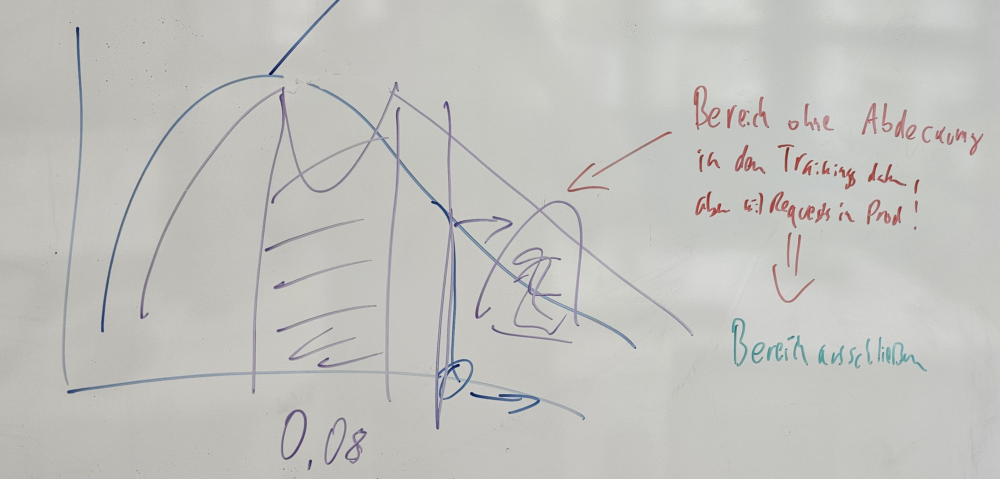

# Story

## Intro
1. Problemstellung: innovative Kfz-Versicherungsgesellschaft
1. https://djcordhose.github.io/mlops/2023-oop.html#/6
1. Ausgangspunkt mit Colab: notebooks/exploration.ipynb
   1. Features
   1. Was wollen wir vorhersagen?
   1. Tests, Training, 
1. Modelle vergammeln in Prod, Grafiken dazu
1. https://djcordhose.github.io/mlops/2023-oop.html#/36
1. Wann sollte man ein neues Modell bringen? Woher weiß man wann und ob ein Modell vergammelt?

## Rolle
* Auftraggeber, Betreiber, Fachabteilung
* Entwickler

## Verantwortlichkeiten
* Gemeinsam
  * War sind die Kriterien für Normalbetrieb?
  * Analyse bei Verlassen des Normalbetriebs
* Auftraggeber, Betreiber, Fachabteilung
  * Verständnis für die Metriken bekommen
* Entwickler
  * Metriken verständlich machen
  * Aktionen nach Analyse nach Verlassen des Normalbetriebs  

## Monitoring

### Hands-On: Produktion simulieren
1. https://djcordhose.github.io/mlops/2023-oop.html#/46
1. Projekt auf Gitpod mit dem Link im Readme des Repos starten: https://gitpod.io/#https://github.com/DJCordhose/mlops-drift
   * sicher gehen, dass es das schnellere Modell ist
1. Gestartete Services inspizieren
   1. Die App auf Port 8080
      1. Einen Request über die Swagger API abfeuern
      1. Einen Request über ein curl
      1. /metrics zeigen
      1. `src/insurance_prediction/monitoring/data_drift.py`
   1. Prometheus auf Port 9090
      1. https://9090-djcordhose-mlopsdrift-062sqfohux7.ws-eu104.gitpod.io/targets?search=
      1. Nach "drift_score_by_columns" suchen
   1. Grafana auf Port 3000
1. Betrieb mit den Live Daten monitoren
   1. `./scripts/curl-drift.sh <URL app server>`
1. Drift auf Gitpod mit dem schlechten Server dauert echt lange
   - Ein Jahr nach ca. 20 min durch
   - Drift nach ca. 20-25 min getektiert
1. Drift in der Reihenfolge 
   1. miles (ca. 15 min auf Gitpod)
   1. emergency_braking (ca. 18 min auf Gitpod)
   1. age (ca. 20 min auf Gitpod)

1. Story:
     1. die Performance des Modells degradiert
	  1. aber wir haben erst nach Jahren eine Ground Truth, die uns das anhand der Metrik zeigt
     1. Warum würde man Drift monitoren, auch wenn man die Ground Truth hat: https://www.evidentlyai.com/blog/ml-monitoring-do-i-need-data-drift
	  1. wir simulieren 3 Jahre Betrieb mit
        1. Leute werden immer Älter, das passiert aber langsam (age)
	     1. Es wird immer weniger Auto gefahren, Leute steigen um auf die Bahn und öffentliche Verkehrsmittel (miles)
	     1. Die Sicherheit der Autos wird immer besser und der Einfluss der individuellen Fahrleistung wird verringert (emergency_braking, pred)  

# Sammlung: Was macht man wenn man Drift vermutet

## Links
* https://www.evidentlyai.com/blog/ml-monitoring-data-drift-how-to-handle
* https://www.evidentlyai.com/blog/retrain-or-not-retrain

## Bilder der Verteilungen analysieren

### Einfacher Drift

Wenn die Form der Verteilung gleich bleibt, aber zu einer Seite driftet, deutet das darauf hin, dass sich beispielsweise das Alter des Publikums allgemein verändert.

### Neue Untergruppe

Wenn eine komplett neue Untergruppe außerhalb der ursprünglichen Form entsteht, sollte man diese Daten ausschließen und ein anderes Vorhersagesystem verwenden.

### Veränderte Ausgabe

Eine stetige Veränderung in den Vorhersagewerten könnte ein Anzeichen für einen feindlichen Angriff sein, der schnelles Handeln erfordert.

### Drift innerhalb der Möglichkeiten des Modells

Ein statistischer Test könnte eine Veränderung anzeigen, die jedoch innerhalb der ursprünglichen Reichweite liegt, was darauf hindeuten könnte, dass das Modell anpassungsfähig genug ist.

# Mehr Material
* Prod hat Einfluss auf die Welt und damit auf das Modell selbst: https://www.linkedin.com/posts/christoph-molnar_we-train-supervised-machine-learning-models-activity-7106935405395992577-DAPC?utm_source=share&utm_medium=member_android
